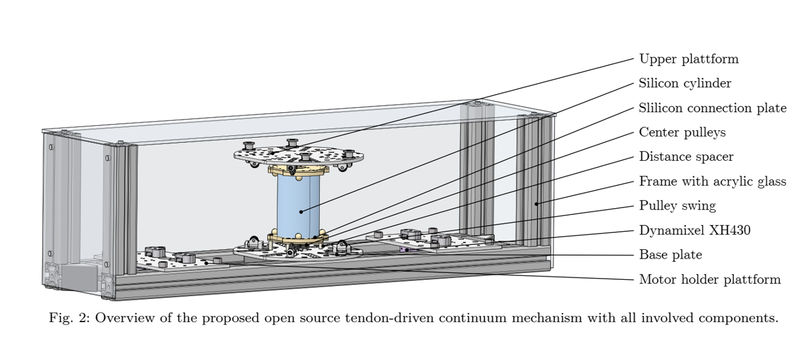

# open source tendon-driven continuum mechanism: a platform for common research in soft robotics 

This repository covers the CAD files (.stp) and assembly instruction to built a tendon-driven continuum mechanism research platform. If you want to built this system, please reference the corresponding publication [1].

The CAD/ folder contains the assembly .stp file "tdc_neck_asm.stp" which shows the assembly of all the parts included. 

[1] Deutschmann, Bastian, Reinecke, Jens, Dietrich, Alexander: "Open Source Tendon-driven Continuum Mechanism: A common Platform for Research in Soft Robotics" submitted to: IEEE International Conference on Soft Robotics (Robosoft), 2022.
